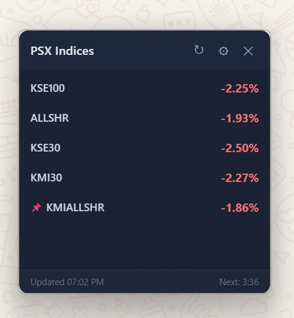
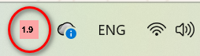

# KSE Index Viewer

A lightweight desktop widget for tracking Pakistan Stock Exchange (PSX) indices in real-time. Built with [Tauri 2](https://tauri.app/) and Rust.

 

## Features

- **Real-time data** — Scrapes live index data from [dps.psx.com.pk](https://dps.psx.com.pk/indices)
- **Dynamic tray icon** — Shows pinned index percentage with 10 intensity color bands (green for positive, red for negative)
- **Always-on-top widget** — Frameless, transparent, stays visible while you work
- **Configurable** — Refresh interval, visible indices, tray pin, always-on-top toggle
- **Auto-start** — Optionally launch on Windows login
- **Lightweight** — ~4MB installer, minimal resource usage

## Screenshots

| Widget | System Tray |
|--------|-------------|
|  |  |

## Installation

### Download

Download the latest installer from [**Releases**](https://github.com/atif-gulzar/KSEIndexViewer/releases/latest).

Run the setup exe — installs per-user, no admin required.

### Build from source

**Prerequisites:**
- [Node.js](https://nodejs.org/) (v18+)
- [Rust](https://rustup.rs/) (stable)

```bash
git clone https://github.com/atif-gulzar/KSEIndexViewer.git
cd KSEIndexViewer
npm install
npm run build
```

The installer will be at `src-tauri/target/release/bundle/nsis/`.

For development:

```bash
npm run dev
```

## Usage

- **Drag** the titlebar to move the widget
- **Right-click** an index row to pin it to the tray icon
- **Click** the X button to hide to tray (not close)
- **Left-click** the tray icon to show the widget
- **Right-click** the tray icon for menu (Show, Refresh, Settings, Exit)

## Settings

- **Visible Indices** — Choose which indices to display
- **Tray Index** — Select which index to show in the tray icon
- **Refresh Interval** — 1, 2, 5, or 10 minutes
- **Always on Top** — Keep widget above other windows
- **Launch at Startup** — Start with Windows

## Tech Stack

- **Frontend:** HTML, CSS, JavaScript
- **Backend:** Rust with Tauri 2
- **Data Source:** Pakistan Stock Exchange ([dps.psx.com.pk](https://dps.psx.com.pk/indices))
- **Installer:** NSIS (Windows)

## License

MIT
