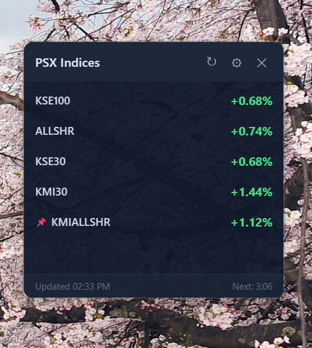

# KSE Index Viewer

A lightweight desktop widget for tracking Pakistan Stock Exchange (PSX) indices in real-time. Built with [Tauri 2](https://tauri.app/) and Rust.

 

## Features

- **Real-time data** — Scrapes live index data from [dps.psx.com.pk](https://dps.psx.com.pk/indices)
- **Portfolio tracking** — Record your buys/sells, see live worth, today's change, unrealized & realized P&L per stock (synced to your own Google Sheet)
- **Dynamic tray icon** — Shows pinned index percentage with 10 intensity color bands (green for positive, red for negative)
- **Always-on-top widget** — Frameless, transparent, stays visible while you work
- **Configurable** — Refresh interval, visible indices, tray pin, always-on-top toggle
- **Auto-start** — Optionally launch on Windows login
- **Lightweight** — ~4MB installer, minimal resource usage

## Screenshots

| Widget | System Tray |
|--------|-------------|
|  |  |

## Installation

### Download

Download the latest installer from [**Releases**](https://github.com/atif-gulzar/KSEIndexViewer/releases/latest).

Run the setup exe — installs per-user, no admin required.

### Build from source

**Prerequisites:**
- [Node.js](https://nodejs.org/) (v18+)
- [Rust](https://rustup.rs/) (stable)

```bash
git clone https://github.com/atif-gulzar/KSEIndexViewer.git
cd KSEIndexViewer
npm install
npm run build
```

The installer will be at `src-tauri/target/release/bundle/nsis/`.

For development:

```bash
npm run dev
```

## Usage

- **Drag** the titlebar to move the widget
- **Right-click** an index row to pin it to the tray icon
- **Click** the X button to hide to tray (not close)
- **Left-click** the tray icon to show the widget
- **Right-click** the tray icon for menu (Show, Refresh, Settings, Exit)

## Settings

- **Visible Indices** — Choose which indices to display
- **Tray Index** — Select which index to show in the tray icon
- **Refresh Interval** — 1, 2, 5, or 10 minutes
- **Always on Top** — Keep widget above other windows
- **Launch at Startup** — Start with Windows
- **Portfolio Google Sheet** — Apps Script Web App URL for portfolio sync (see below)

## Portfolio Setup (one-time)

The **Portfolio** tab tracks your holdings using a Google Sheet you own. Setup takes about 3 minutes.

### Why a Google Sheet (and an Apps Script)?

This is a hobby app distributed for free — there's no backend server, no signup, no database. To store your transactions somewhere persistent and sharable across devices, the app needs *somewhere* to read and write them. The options are:

| Option | Why not |
|---|---|
| **Local file only** | Your portfolio dies when you reinstall, switch PCs, or your disk fails. No backup. |
| **A hosted cloud database** | Would mean running a paid server and you trusting me with your trade data. Both are non-starters for a free side-project. |
| **OAuth into your Google Drive** | Requires me to register an OAuth client, ship API keys inside the app, and ask you for full Drive access. Heavy and creepy for what should be a simple widget. |
| **Google Sheet via Apps Script** ✅ | **You own the data**, **you own the auth**, the sheet is just a file in your Drive. Zero credentials are bundled in this app. The app talks to a Web App URL *you* deployed; only you (or someone with that URL) can read/write your sheet. |

The Apps Script you paste is a tiny 30-line script that exposes two endpoints on your sheet: `GET` (list rows) and `POST` (append a row). It only touches the sheet you create it in — nothing else in your Drive, Gmail, or Google account. You can read every line before deploying it, archive the deployment anytime, or open the sheet directly to edit/delete rows by hand.

**TL;DR:** your portfolio data lives in a Google Sheet *in your account*. The app is just a UI on top of it.

### Setup steps


1. Create a new blank Google Sheet (any name)
2. **Extensions → Apps Script**
3. Replace the default code with the [Apps Script code below](#apps-script-code) (or use the widget's **Settings ⚙ → Copy Apps Script code** button), then **Save**
4. Click **Deploy → New deployment → Type: Web app**
   - **Execute as:** Me
   - **Who has access:** Anyone
   - Click **Deploy**
5. Authorize the script when prompted (it only touches your own sheet)
6. Copy the **Web App URL** Google gives you and paste it into the widget's Portfolio Google Sheet field
7. **Save Settings** — the widget will immediately pull any existing transactions

### Apps Script code

Paste this verbatim into the Apps Script editor in step 3 above:

```javascript
// KSE Index Viewer — Portfolio sync
const SHEET_NAME = 'Transactions';

function ensureSheet_() {
  const ss = SpreadsheetApp.getActiveSpreadsheet();
  let sheet = ss.getSheetByName(SHEET_NAME);
  if (!sheet) sheet = ss.insertSheet(SHEET_NAME);
  if (sheet.getLastRow() === 0) {
    sheet.appendRow(['Date', 'Symbol', 'Side', 'Shares', 'Price']);
  }
  return sheet;
}

function doGet(e) {
  const sheet = ensureSheet_();
  const values = sheet.getDataRange().getValues();
  const rows = values.slice(1).map(function(r) {
    return {
      date: r[0] instanceof Date
        ? Utilities.formatDate(r[0], Session.getScriptTimeZone(), 'yyyy-MM-dd')
        : String(r[0]),
      symbol: String(r[1]).toUpperCase(),
      side: String(r[2]).toUpperCase(),
      shares: Number(r[3]),
      price: Number(r[4])
    };
  }).filter(function(r) {
    return r.symbol && !isNaN(r.shares) && !isNaN(r.price);
  });
  return ContentService.createTextOutput(JSON.stringify({ ok: true, transactions: rows }))
    .setMimeType(ContentService.MimeType.JSON);
}

function doPost(e) {
  try {
    const data = JSON.parse(e.postData.contents);
    const sheet = ensureSheet_();
    sheet.appendRow([
      data.date || Utilities.formatDate(new Date(), Session.getScriptTimeZone(), 'yyyy-MM-dd'),
      String(data.symbol).toUpperCase(),
      String(data.side).toUpperCase(),
      Number(data.shares),
      Number(data.price)
    ]);
    return ContentService.createTextOutput(JSON.stringify({ ok: true }))
      .setMimeType(ContentService.MimeType.JSON);
  } catch (err) {
    return ContentService.createTextOutput(JSON.stringify({ ok: false, error: String(err) }))
      .setMimeType(ContentService.MimeType.JSON);
  }
}
```

The script creates a `Transactions` sheet with columns `Date | Symbol | Side | Shares | Price`. You can manually add, edit, or delete rows in the sheet at any time — the widget picks up changes on the next refresh.

Once connected:
- **Add Transaction** form on the Portfolio tab posts new buys/sells to your sheet (auto-stamped with today's date)
- Existing rows you edit directly in the sheet are picked up on next refresh
- The local cache means the Portfolio tab loads instantly even before the sheet syncs

**What gets tracked per holding:** symbol, total shares, average cost, current price, today's change (Rs and %), current worth, unrealized gain/loss with %, and realized gain/loss from partial sells. Top of the tab shows totals across all holdings.

## Tech Stack

- **Frontend:** HTML, CSS, JavaScript
- **Backend:** Rust with Tauri 2
- **Data Sources:** Pakistan Stock Exchange ([indices](https://dps.psx.com.pk/indices), [market-watch](https://dps.psx.com.pk/market-watch))
- **Portfolio Storage:** Your own Google Sheet via Apps Script Web App (you own the data)
- **Installer:** NSIS (Windows)

## License

MIT
